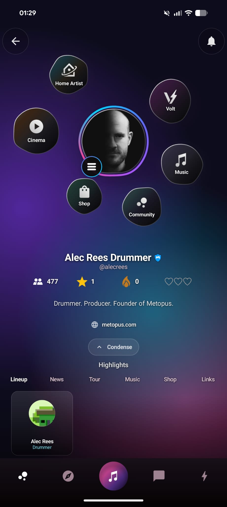
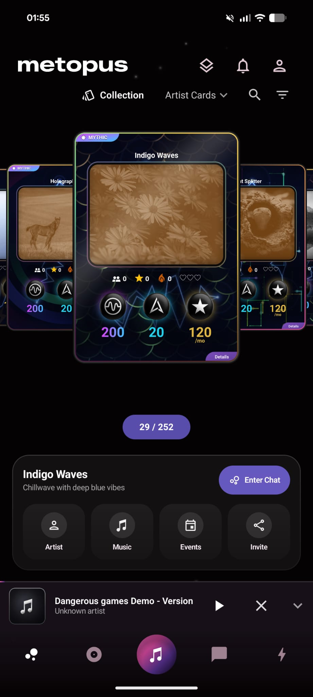
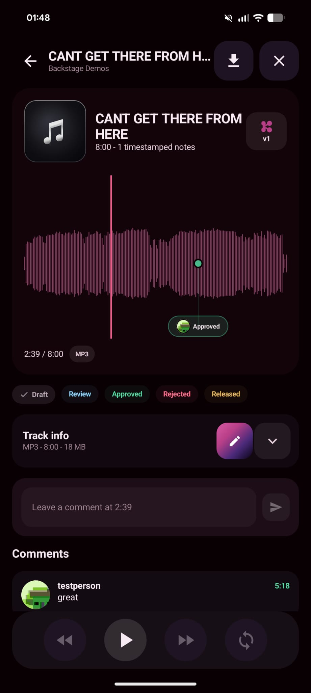
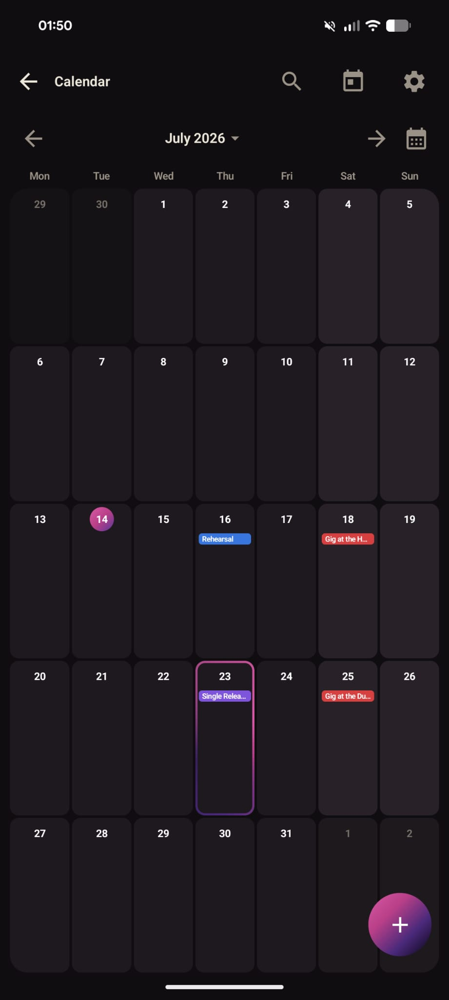
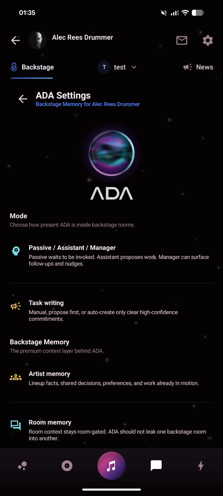
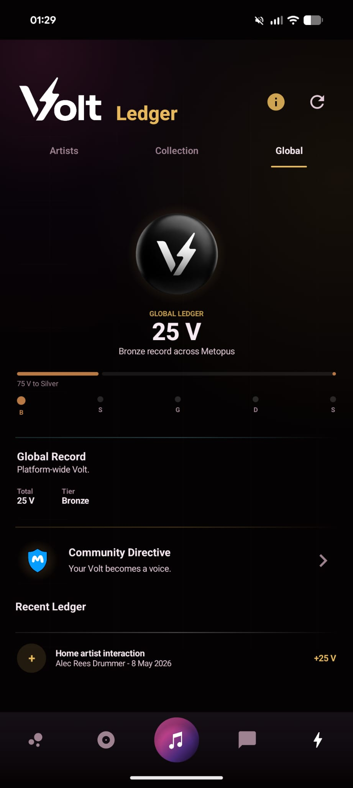
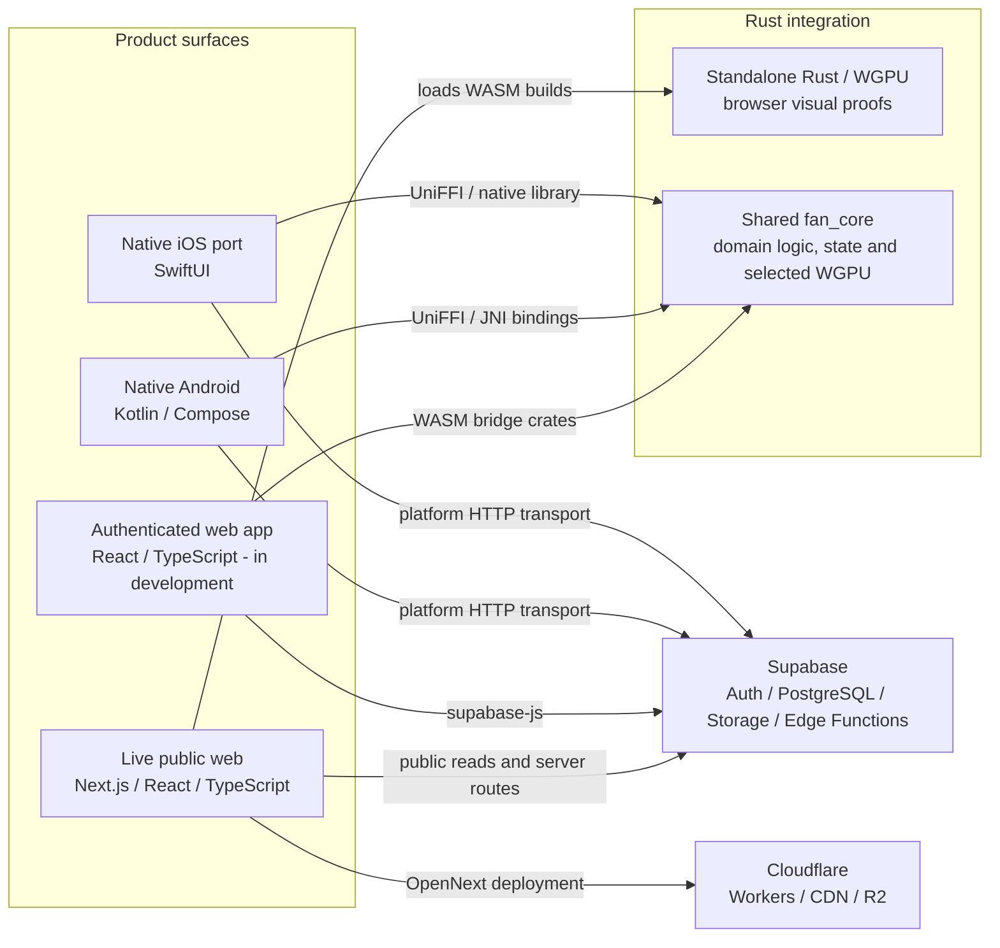

<p align="center">
  
</p>

# Metopus product and engineering case study

Metopus is a mobile and web platform for artists and fan communities, developed by Alec Rees through [Metopida Ltd](https://metopida.com/). It grew from roughly two decades of first-hand music-industry experience and three years of product research, prototyping and development.

This repository documents the product, architecture and engineering decisions without publishing the commercial source code.

[Live product site](https://metopus.com/) | [Portfolio case study](https://www.alecreesdrummer.com/#metopus) | [LinkedIn](https://www.linkedin.com/in/alec-rees)

## Interactive code demo

The [`demo/`](demo/) directory contains a runnable, public-safe Culture/Scene Explorer built with React, TypeScript and a small Rust/WebAssembly layout engine. It uses fictional fixture data and simplified rules to demonstrate typed state, responsive interaction, view transitions and the browser-to-WASM boundary without publishing the production Metopus renderer or commercial logic.

```bash
cd demo
npm install
npm run dev
```

The demo includes TypeScript contract tests, Rust layout and transition tests, a production build and path-scoped continuous integration.

## Product surfaces

<p align="center">
  
  
  
</p>

<p align="center">
  
  
  
</p>

- **Artist World** connects public identity, music, community and artist tools.
- **Artist cards** use an original collectible visual system for discovery and fan participation.
- **Backstage audio review** supports versions, timestamped notes and approval stages.
- **Calendar** brings rehearsals, gigs and release milestones into one workspace.
- **AI workflow controls** show the pre-launch interface for assistance modes and room-scoped memory.
- **Volt** records participation and progression through a transparent ledger.

## The problem

Artists increasingly depend on platforms whose algorithms, reach and audience relationships they do not control. Metopus is designed to give artists a public home, direct fan capture and deeper community tools, while also supporting the practical work behind releases, rehearsals, events and live performance.

The goal is not to reproduce another social feed. It is to connect artist identity, fan participation and day-to-day artist workflows in one product.

## My role

**Founder and product developer.** I am responsible for product direction, feature research, UX and original visual design, architecture, implementation and integration, testing, documentation and commercial planning.

I use AI tools for research, planning, scaffolding, debugging and review. I check the output against the existing system, test it on real hardware and remain responsible for the design, technical decisions, integration and final quality.

## Current build

| Area | Current evidence | Status |
| --- | --- | --- |
| Android | Kotlin and Jetpack Compose client, native navigation, app workflows and custom graphics surfaces | Working implementation |
| iOS | SwiftUI client, authentication foundation, design system, Rust bindings and physical-device deployment | Native parity port in progress |
| Shared core | Rust domain logic, validation, state and rendering shared through native bindings and selected WebAssembly builds | Working implementation |
| Graphics | Original WGPU/WGSL card and environmental visual systems with device-aware performance work | Working implementation |
| Web | Live Next.js/React public site plus a React/TypeScript app foundation with selected Rust/WASM integration | Live and in development |
| Backend | Supabase/PostgreSQL for authentication, data and storage; Cloudflare for public deployment and media infrastructure | Working infrastructure |

The first MVP was built in Flutter. That reference helped validate the product and interaction model before the move to native Android and iOS clients with a shared Rust core.

## Architecture



The split is deliberate: public web routes prioritise discovery and accessibility; native clients handle richer interaction and device integration; and `fan_core` owns selected logic and rendering that should not drift between supported clients. The public website's lightweight Rust/WGPU visuals are separate browser builds, while the authenticated web app uses wrapper crates that compile selected `fan_core` functionality to WebAssembly. On native clients, Rust can build and parse selected backend request contracts while Kotlin or Swift performs the platform network transport.

## Selected engineering decisions

### MVP to native

Flutter accelerated the first end-to-end MVP. The native rebuild uses Kotlin/Compose and SwiftUI where platform integration, graphics performance and app behaviour matter, while Rust reduces duplicated rules between clients.

### Original renderer and motion system

Metopus uses a bespoke visual language rather than a standard component theme. Artist cards, cellular navigation and spiral/orbit motion were designed for the product and implemented through Rust, WGPU/WGSL and WebAssembly where appropriate. Real-device testing has informed render profiles and graceful fallbacks for different mobile GPU classes.

### Commandable artist tools

Calendar, audio review, tour, release and other artist tools are being structured around typed actions, validation, permissions and audit metadata. The same actions can later be used by the interface or proposed by an AI workflow without giving an agent unrestricted access to product data.

### Safety outside the UI

Age, entitlement and permission decisions should not rely on a single screen hiding a control. The architecture places important rules in shared logic and server-side checks, with the clients rendering the resulting capabilities.

## AI product R&D

Metopus includes a five-role agent architecture for artist coordination, opportunity discovery, events and ticketing, promotion and tour logistics. The user-facing coordinator is designed to work inside Backstage rather than as a generic chatbot.

Key design work includes:

- **Backstage Memory:** artist-, room- and person-scoped context for decisions, responsibilities and work already in motion.
- **Typed actions:** structured tool inputs with permissions, validation, risk levels and audit records.
- **Human approval:** higher-impact actions are proposed for confirmation rather than executed silently.
- **Sandbox testing:** agent roles and behaviour are tested separately before production integration.

The agent system is pre-launch R&D, not a shipped claim. Later research also covers three separate areas: user-requested product sourcing and procurement, **Road Grade** trust signals based on real professional use, and gig/opportunity discovery.

## Testing

The test approach spans:

- Rust tests and native binding checks
- Android reference behaviour and iOS parity work
- browser, TypeScript and WebAssembly integration
- real Android and iOS hardware across newer and older GPU classes
- responsive layout, touch behaviour and large system text
- graphics profiling, fallbacks and device-aware quality settings
- auth, onboarding, age and capability boundaries

Exact device details, private logs and profiler captures are intentionally excluded. See [testing and device coverage](docs/07-testing-and-device-coverage.md) for the public summary.

## Further detail

- [Product scope and status](docs/01-product-overview.md)
- [Public architecture](docs/02-public-architecture.md)
- [Role and implementation decisions](docs/03-role-and-implementation.md)
- [AI-assisted development workflow](docs/04-ai-assisted-development-workflow.md)
- [Selected implementation map](docs/06-selected-implementation-map.md)
- [Screenshot notes](docs/08-screenshots-and-walkthrough.md)
- [Confidentiality boundaries](docs/05-confidentiality-boundaries.md)

## Why the source is private

Metopus is an active commercial product. Its production repositories contain proprietary product logic, security-sensitive backend work, unreleased features, private configuration and protected assets. This case study provides reviewable evidence without turning the product into an open-source release.

Architecture, implementation decisions and selected technical details can be discussed in interview where appropriate.
