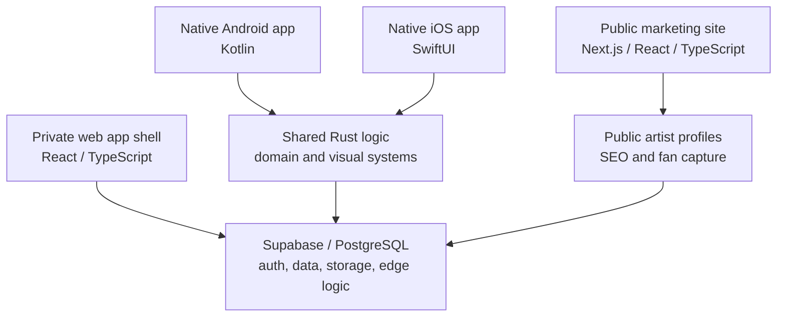

# Metopus Product Case Study

Metopus is an early-stage, commercially sensitive platform for artists and fan communities. The product explores direct-to-fan community, public artist profiles, mailing-list capture, interactive cards, artist tools, native mobile experiences and shared product logic across platforms.

This repository is a public, documentation-only case study. It does not contain production source code, private database structure, credentials, proprietary mechanics or commercial implementation details.

No open-source licence is granted for this repository. It is public for portfolio and case-study review only.

## Why This Exists

The production Metopus repositories are private because the product contains protected intellectual property, security-sensitive implementation work and unfinished commercial logic.

This case study exists to show the non-confidential parts of the work:

- product framing and problem definition
- cross-platform architecture
- public web and app-surface strategy
- front-end and visual-system decisions
- shared Rust logic direction
- testing and device coverage
- AI-assisted development workflow
- confidentiality and publication boundaries

## My Role

Founder and product developer.

I defined the product direction, planned the system architecture, built and tested public-facing web surfaces, worked across web/mobile/shared-logic concerns, and used AI-assisted development tools to accelerate implementation while retaining responsibility for review, integration and quality.

This is not presented as a solo claim of senior expertise in every technology used. The useful evidence is product ownership, system thinking, implementation judgement, technical communication, integration and testing across a broad product surface.

## Public-Safe Architecture



At a high level, Metopus is split into:

- a public web layer for marketing, artist discovery and fan capture
- authenticated app surfaces for artists and fans
- native Android and iOS clients
- shared Rust logic where consistency and performance matter
- Supabase/PostgreSQL infrastructure for authentication, data and storage
- Cloudflare infrastructure for public web deployment and media-adjacent work

The public diagram intentionally avoids private schemas, security rules, admin flows, proprietary product mechanics and unreleased business logic.

## Repository Structure

```text
docs/
  01-product-overview.md
  02-public-architecture.md
  03-role-and-implementation.md
  04-ai-assisted-development-workflow.md
  05-confidentiality-boundaries.md
assets/
  screenshots/
  diagrams/
```

## What Recruiters Can Review

This repository is meant to support roles where product thinking, technical communication, front-end judgement, implementation support, digital content, technical support, QA, onboarding or creative technology are relevant.

It demonstrates:

- the ability to turn an ambiguous product idea into structured systems
- a practical understanding of cross-platform product tradeoffs
- clear public/private boundaries around commercial software
- familiarity with modern web, mobile and backend-adjacent tooling
- a responsible approach to AI-assisted development
- attention to testing, device coverage and user experience

## Publication Status

Draft stage. Screenshots, diagrams and live links should be added only after a privacy and IP check.
