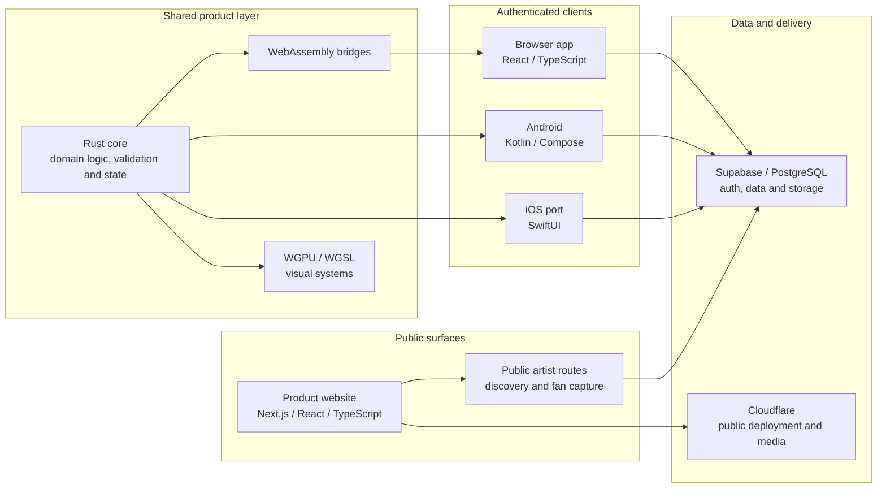

# Public architecture

This is a deliberately high-level view. It omits private schemas, policies, credentials, admin operations and proprietary product mechanics.

## System map

## Responsibility split

### Public web

The public layer handles product explanation, search-friendly artist routes, public campaign entry points and fan capture. It must work without an installed app or existing account.

### Browser app

The browser app supports web-appropriate artist and fan workflows. React and TypeScript own the shell, while selected rules and visual behaviour can be supplied by Rust compiled to WebAssembly.

### Native clients

Android is the current native reference. The iOS client is being ported in SwiftUI against documented Android behaviour rather than rebuilt from screenshots or memory.

### Shared Rust core

Rust is used where duplicated client logic would create drift. Its responsibilities include domain decisions, validation, state, native bindings and selected rendering systems. It is not used merely to add another language to the stack.

### Graphics

Custom WGPU/WGSL surfaces support the card, cellular and motion language. Platform clients still own lifecycle, touch, accessibility and device integration around those surfaces.

### Backend and delivery

Supabase/PostgreSQL provides authentication, data and storage services. Cloudflare supports public deployment and media-adjacent infrastructure. Important permission and age decisions are intended to have shared or server-side enforcement rather than depend on UI visibility.

## Main tradeoff

The architecture balances web reach, native interaction quality, shared behaviour and commercial confidentiality. This creates more integration work than a single-client application, but it prevents the public website, browser app and native clients from being forced into the same technical shape.
