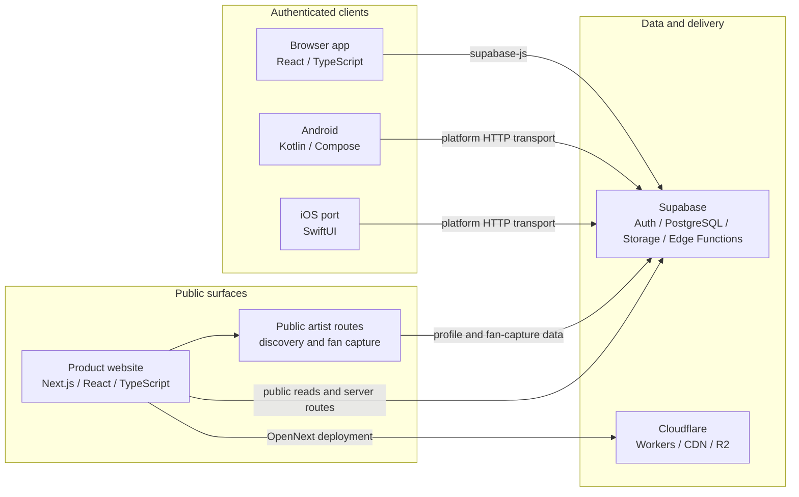
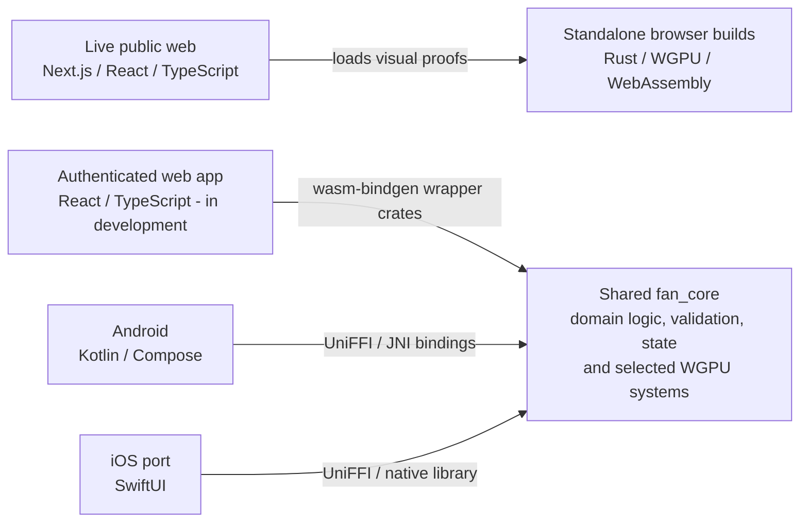

# Public architecture

This is a deliberately high-level view. It omits private schemas, policies, credentials, admin operations and proprietary product mechanics.

## Runtime and delivery map

## Shared-code integration

These are two different Rust paths. The lightweight visual proofs on the public website are browser-specific builds. The authenticated web app's WebAssembly wrappers depend on the same `fan_core` used by the native clients.

## Responsibility split

### Public web

The public layer handles product explanation, search-friendly artist routes, public campaign entry points and fan capture. It must work without an installed app or existing account. It is deployed to Cloudflare through OpenNext and uses Cloudflare R2 for selected cache and generated-media responsibilities.

### Browser app

The browser app supports web-appropriate artist and fan workflows. React and TypeScript own the shell and communicate with Supabase through `supabase-js`. Rust wrapper crates compile selected shared rules and visual behaviour from `fan_core` to WebAssembly.

### Native clients

Android is the current native reference. It calls `fan_core` through generated Kotlin bindings and JNI/native libraries. The iOS client is being ported in SwiftUI against documented Android behaviour and calls the same core through generated Swift bindings and a native library/XCFramework build.

### Shared Rust core

Rust is used where duplicated client logic would create drift. Its responsibilities include domain decisions, validation, state, selected backend request and response contracts, native bindings and selected rendering systems. On Android and iOS, Rust can build or parse a request contract while the platform client performs the HTTP transport. It is not used merely to add another language to the stack.

### Graphics

Custom WGPU/WGSL surfaces support the card, cellular and motion language. Selected native and authenticated-web rendering paths use `fan_core`; the live public website also contains separate lightweight Rust/WGPU browser proofs. Platform clients still own lifecycle, touch, accessibility and device integration around those surfaces.

### Backend and delivery

Supabase/PostgreSQL provides authentication, data and storage services. Cloudflare supports public deployment and media-adjacent infrastructure. Important permission and age decisions are intended to have shared or server-side enforcement rather than depend on UI visibility.

## Main tradeoff

The architecture balances web reach, native interaction quality, shared behaviour and commercial confidentiality. This creates more integration work than a single-client application, but it prevents the public website, browser app and native clients from being forced into the same technical shape.
