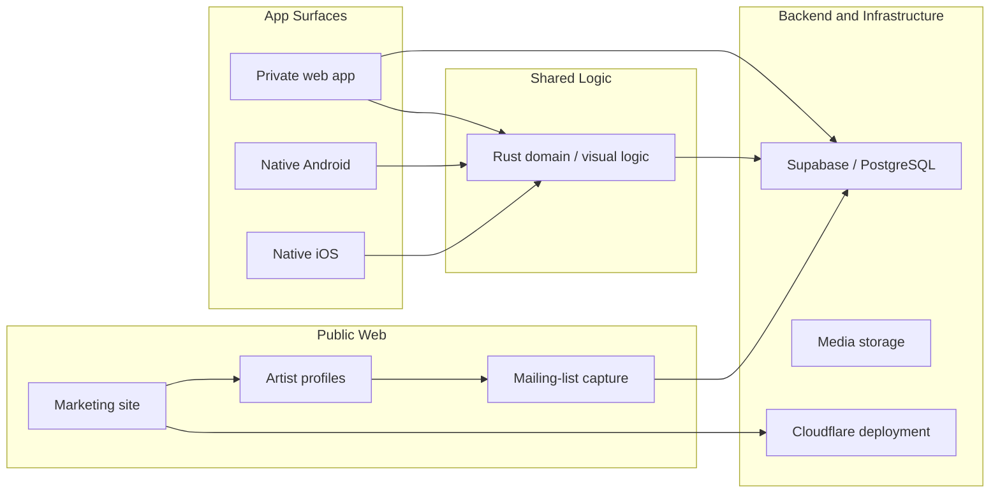

# Public Architecture

This document describes the public-safe architecture. It intentionally omits private source code, schema details, security rules, proprietary mechanics and unreleased implementation decisions.

## High-Level System

## Public Web Layer

The public web layer is intended for:

- marketing pages
- SEO-friendly public artist profiles
- public campaign entry points
- mailing-list and QR-code flows
- app handoff for deeper authenticated experiences

The practical requirement is that a public artist profile should be fast, readable, shareable and indexable. It should not depend on the user already having the app installed.

## Authenticated App Surfaces

Metopus is planned across:

- a client-first private web app shell for selected app workflows
- a native Android app
- a native iOS app

The native apps are used where performance, device integration, notifications and polished interaction matter. The web app is used where browser access, artist tooling, admin workflows or lighter fan journeys make more sense.

## Shared Rust Logic

Rust is used as a shared logic direction where it helps consistency, performance or cross-platform maintainability.

Public-safe examples include:

- shared domain decisions
- shared visual or rendering logic
- consistent behaviour across Android and iOS
- request-building or rules logic where duplication would create drift

This case study deliberately avoids publishing proprietary source code or detailed implementation rules.

## Backend and Infrastructure

Metopus uses Supabase/PostgreSQL for backend-adjacent product needs such as authentication, database-backed state, storage, public capture flows and server-side validation.

Cloudflare is used around public web deployment and related infrastructure decisions.

The public case study can discuss technology choices and tradeoffs, but should not publish service-role logic, private policy details, admin routes, secrets, migrations that reveal protected mechanics, or security-sensitive implementation specifics.

## Main Tradeoff

The core architectural tradeoff is balancing:

- the speed of web delivery
- the polish and performance of native clients
- the maintainability of shared logic
- the commercial need to keep certain product mechanics private

The product therefore uses public documentation and screenshots as proof, while keeping the production repositories private.
