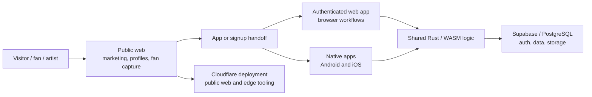
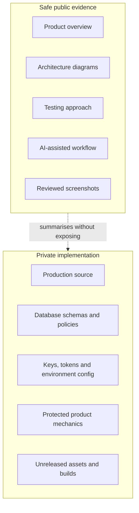
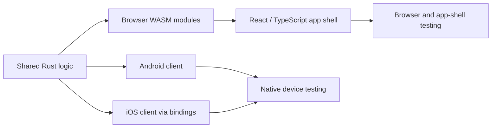

# Public-Safe Diagrams

These diagrams are intended for portfolio review. They explain system shape and ownership boundaries without exposing private source code, schemas, security rules, credentials, proprietary mechanics or unpublished commercial details.

## Product Surface Map

What this shows:

- public discovery and authenticated app work are separate concerns
- native apps exist where performance and device integration matter
- Rust/WebAssembly is used where consistency or rendering behaviour benefits from shared logic
- backend and infrastructure details are deliberately abstracted

## Public And Private Boundary

What this shows:

- the public case study is a summary layer, not a substitute repository
- the useful proof is architecture, judgement, process and selected reviewed visuals
- private implementation remains protected

## Shared Logic Direction

What this shows:

- shared logic reduces behavioural drift between app surfaces
- browser-facing Rust can be compiled through WebAssembly where appropriate
- native and web surfaces still need their own testing layers

## Evidence Map

```mermaid
flowchart TD
    Product["Product ownership"] --> Architecture["Architecture documents"]
    Product --> Copy["Public product explanation"]
    Product --> Boundaries["Confidentiality rules"]

    Implementation["Implementation judgement"] --> Web["Public web / app-shell strategy"]
    Implementation --> Rust["Rust / WASM direction"]
    Implementation --> Native["Native Android / iOS direction"]

    Quality["Quality and testing"] --> Devices["Real hardware classes"]
    Quality --> Safety["Safety and onboarding checks"]
    Quality --> Visuals["Visual and graphics behaviour"]

    Communication["Technical communication"] --> Summary["Executive summary"]
    Communication --> Walkthrough["Public walkthrough script"]
    Communication --> Interview["Interview discussion points"]
```

What this shows:

- the case study is aimed at human review, not just repository browsing
- it connects product, implementation, quality and communication into one coherent evidence layer
